# Smart Command Line System

SmartCLI is a Java 17 command-line interpreter built for CAP477 at Lovely Professional University. It combines real disk-based file commands, a SmartCLI-managed working directory, natural-language command interpretation through NVIDIA AI, and safe operating-system command passthrough.



The animation above condenses the real terminal flow: Maven build, Unicode launch, OS passthrough commands, `mkdir`, failed Windows `ls`, SmartCLI `cd`, real file creation, write/read, `list`, and AI-powered file creation.

## Project Snapshot

| Item | Details |
|---|---|
| Language | Java 17 |
| Build tool | Maven |
| Main package | `com.lpu.smartcli` |
| Entry point | `com.lpu.smartcli.ui.Terminal` |
| Runnable JAR | `target/SmartCLI.jar` |
| Test framework | JUnit 5 |
| Current test count | 109 tests |

## Feature Analysis

### 1. Real Disk-Based File System

SmartCLI now creates, writes, reads, deletes, and lists real files on disk. The file layer is implemented in `com.lpu.smartcli.data.FileSystem` using `java.nio.file.Files`.

What this means:

- `create hello.py` creates an actual `hello.py` file.
- `write hello.py ...` writes text into that real file.
- `read hello.py` reads the real file contents from disk.
- `delete hello.py` removes the real file.
- `list` shows files from the current working directory on disk.

The original `HashMap<String, String>` is still kept for session tracking, but it is no longer the source of truth for file storage.

### 2. Working Directory Support

SmartCLI has its own working directory, initialized from:

```java
System.getProperty("user.dir")
```

You can inspect or change it using built-in commands:

```text
smartcli> pwd
Current directory: E:\lpu semester 2\java\SmartCLI

smartcli> cd E:\movie
Working directory changed to: E:\movie
```

All SmartCLI file commands are resolved relative to this working directory.

### 3. Built-In File Commands

| Command | Purpose |
|---|---|
| `create <filename>` | Creates a real file in the current SmartCLI directory |
| `write <filename> <content>` | Writes text to a real file |
| `read <filename>` | Displays file contents |
| `delete <filename>` | Deletes a real file |
| `list` | Lists files in the current SmartCLI directory |
| `cd <path>` | Changes the SmartCLI working directory |
| `pwd` | Prints the SmartCLI working directory |
| `help` | Shows all built-in commands |
| `exit` | Exits the application |

Paths with spaces are supported:

```text
smartcli> cd E:\lpu semester 2\java\SmartCLI
Working directory changed to: E:\lpu semester 2\java\SmartCLI
```

### 4. Operating-System Command Passthrough

Unknown commands are passed to the real operating system through `ProcessBuilder`.

Examples:

```text
smartcli> dir
smartcli> ipconfig
smartcli> git status
smartcli> java -version
```

OS commands now run from the SmartCLI working directory, so this works naturally:

```text
smartcli> cd E:\movie
smartcli> create hello.py
smartcli> dir
```

On Windows, use `dir`. The command `ls` is usually not available in `cmd.exe` unless you have extra Unix tools installed.

### 5. AI Natural-Language Commands

SmartCLI can translate natural language into one CLI command using NVIDIA's Minimax model.

Example inputs:

```text
smartcli> make file with the name of testing2.py
[AI] Interpreted as: create testing2.py
File 'testing2.py' created at E:\lpu semester 2\javatest\testing2.py

smartcli> write hello world program in hello.py
[AI] Interpreted as: write hello.py hello world program
Written to 'E:\lpu semester 2\javatest\hello.py'.
```

AI configuration is read from `config.properties`:

```properties
nvidia.api.key=YOUR_NVIDIA_API_KEY
```

`config.properties` is ignored by Git so private API keys are not pushed.

If AI configuration is missing, SmartCLI continues running and falls back safely.

### 6. Safety Filter for OS Commands

Before passthrough commands run, SmartCLI checks them with `SafetyFilter`.

It protects against:

- Dangerous commands such as destructive deletes
- Interactive commands that can freeze the CLI
- Long-running commands that should not block the session forever
- Sensitive commands that need confirmation

### 7. Smart CLI Utilities

The project also includes utility modules for:

- Command parsing
- Autocomplete
- Autocorrect
- Fuzzy search
- Syntax highlighting
- Session management
- Command history
- Git integration
- Process management
- System information
- File-system browsing

### 8. Testing

The project includes a JUnit 5 test suite covering the data layer, file operations, history, sessions, integration helpers, and smart-search utilities.

Current result:

```text
Tests run: 109, Failures: 0, Errors: 0, Skipped: 0
BUILD SUCCESS
```

## Build

Open PowerShell in the project root:

```powershell
cd "E:\lpu semester 2\java\SmartCLI"
```

If the bundled Maven folder exists locally:

```powershell
.\.tools\apache-maven-3.9.9\bin\mvn.cmd clean package -DskipTests
```

If Maven is installed globally:

```powershell
mvn clean package -DskipTests
```

The JAR is created here:

```text
target\SmartCLI.jar
```

## Run

For best Unicode output on Windows:

```powershell
cmd.exe /c "chcp 65001 & java -Dfile.encoding=UTF-8 -jar target\SmartCLI.jar"
```

Or directly:

```powershell
java -Dfile.encoding=UTF-8 -jar target\SmartCLI.jar
```

## Run Tests

Using bundled Maven:

```powershell
.\.tools\apache-maven-3.9.9\bin\mvn.cmd test
```

Using global Maven:

```powershell
mvn test
```

## Demo

```text
╔══════════════════════════════════════╗
║   Smart Command Line System v1.0     ║
║   LPU | CAP477 | Section D2526       ║
║   Supervisor: Dr. Prince Arora       ║
╚══════════════════════════════════════╝
Type 'help' to see all commands. Type 'exit' to quit.

smartcli> pwd
Current directory: E:\lpu semester 2\java\SmartCLI

smartcli> cd E:\lpu semester 2\javatest
Working directory changed to: E:\lpu semester 2\javatest

smartcli> create hello.java
File 'hello.java' created at E:\lpu semester 2\javatest\hello.java

smartcli> write hello.java this is the testing file
Written to 'E:\lpu semester 2\javatest\hello.java'.

smartcli> read hello.java
--- hello.java ---
this is the testing file
-----------------

smartcli> create a python file with name niraj.py
[AI] Interpreted as: create niraj.py
File 'niraj.py' created at E:\lpu semester 2\javatest\niraj.py

smartcli> dir
hello.java and niraj.py appear in the real Windows directory listing.
```

## Architecture

```text
src/main/java/com/lpu/smartcli
├── ai              NVIDIA AI command interpreter
├── commands        Built-in commands and OS passthrough
├── core            Command interface and command-result helpers
├── data            Disk-backed FileSystem, sessions, history
├── integration     Git, process, system, and file-browser helpers
├── plugins         Plugin API and loader classes
├── smart           Autocomplete, autocorrect, fuzzy search, highlighting
├── storage         Alias and config stores
├── ui              Terminal, parser, help, and UI shell
└── utils           Logging, validation, safety, output helpers
```

## Important Notes

- SmartCLI file commands now create real files. Be mindful when using `delete`.
- `cd` changes SmartCLI's working directory, not the parent PowerShell window after SmartCLI exits.
- `dir` is a Windows OS command and will show the same current directory that SmartCLI is using.
- `config.properties` should stay local because it contains your NVIDIA API key.
- `target/` is build output and is ignored by Git.

## Team

- Nitish Kumar (RD2536B60) - Team Leader
- Nikita Chauhan (RD2526B37)
- Ayush Kumar (RD2526B41)

Supervisor: Dr. Prince Arora

Course: CAP477, LPU
